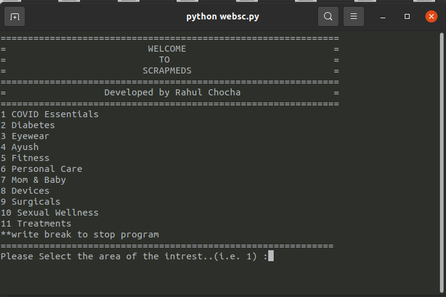
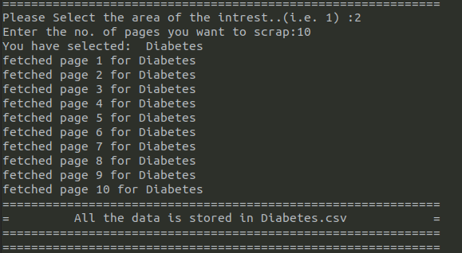

# SCRAPMEDS
Python script for scraping the data of netmeds.com

# About 
## Status : Fully Functional :)
* Base url https://www.netmeds.com/ is used for scraping the data.
* Functionality of category wise scraping.
* Multiple pages can be fetched as well.
* Scraped data can be stored in .csv file
* Tested script by scraping 10 pages of each category (examples inside the [CSVs](https://github.com/mrchocha/scrapmeds/tree/main/CSVs) folder).
  
# Scraped Fields
* Product name
* Drug varient
* Product photo url
* Product url
* Final price
* Original price
* Offer
* is_in_stock 

# Tool and Techno.
* beautifulsoup4 (v4.9.3)
* requests (v2.25.1)
* numpy (v1.20.2)
* pandas (v1.2.3)
* os
  
# Screenshots



# How to start?
for  ubuntu write
```
python3 scrapmads.py
```

for windows
```
python scrapmads.py
```

# Thank you

